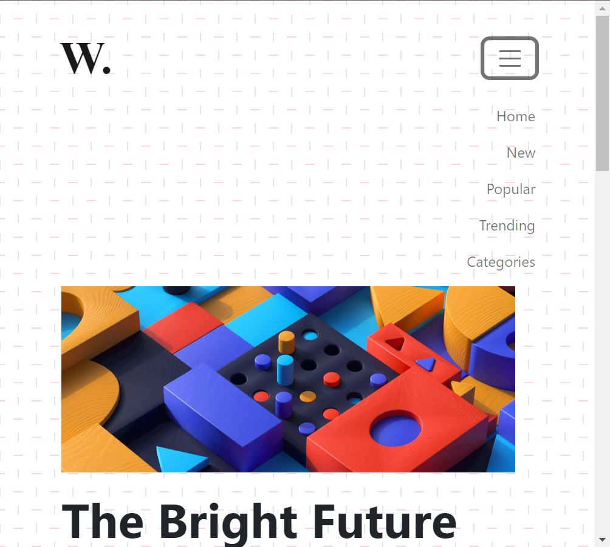

# This is eighth project on DOM
## The project's purpose is to create same output as that of output files shared without touching given HTML code(index.html).
### ass8.1-after.png file looks like:


### For this following javascript code needs to be written which targets current HTML(index.html) to make it look like ass8.1-after.png file. 
```javascript
let vardiv=document.querySelector(".new");
vardiv.style.overflow="auto"; 
```
### ass8.2-after.png file looks like:


### For this following javascript code needs to be written which targets current HTML(index.html) to make it look like ass8.2-after.png file. 
```javascript
document.body.style.backgroundImage="none";
```
### ass8.3-after.png file looks like:



### For this following javascript code needs to be written which targets current HTML(index.html) to make it look like ass8.3-after.png file. (Note that the output can be seen when window is resized to smaller size.)
```javascript
let varnav=document.querySelector("#navbarTogglerDemo01");
varnav.classList.remove("collapse");
```
