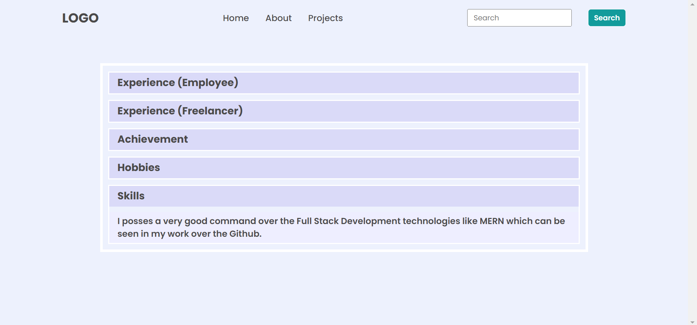

# This is second project on DOM
## The project's purpose is to create same output as that of output files shared without touching given HTML code(about.html).
### Task1 - task1Output.png file looks like:


### For this following javascript code needs to be written which targets current HTML(about.html) to make it look like task1Output.png file. 
```javascript
let varul=document.querySelector("ul");
let varli;
let varlink;
varli=varul.querySelectorAll("li");
varul.removeChild(varli[2]);
varli=document.createElement("li");
varlink=document.createElement("a");
varlink.innerText="Projects";
varlink.href="#";
varli.appendChild(varlink);
varul.appendChild(varli);
let varh3=document.querySelectorAll("h3");
for(const i of varh3)
{
	i.style.backgroundColor="#DADAF8";
} 
```
### Task2 - task2Output.png file looks like:



### For this following javascript code needs to be written which targets current HTML(about.html) to make it look like task2Output.png file. 
```javascript
let varul=document.querySelector("ul");
let varli;
let varlink;
varli=varul.querySelectorAll("li");
varul.removeChild(varli[2]);
varli=document.createElement("li");
varlink=document.createElement("a");
varlink.innerText="Projects";
varlink.href="#";
varli.appendChild(varlink);
varul.appendChild(varli);
let vardivmain=document.getElementsByClassName("accordian-wrapper");
let vardiv=document.createElement("div");
vardiv.className="accordian";    
vardivmain[0].appendChild(vardiv);
let varh3;
varh3=document.createElement("h3");
varh3.innerText="Skills";
vardiv.appendChild(varh3);
varp=document.createElement("p");
varp.innerText="I posses a very good command over the Full Stack Developement technologies like MERN which can be seen in my work over the Github.";
vardiv.appendChild(varp);
varh3.addEventListener("click", () => {
    if (varp.style.display === "block") {
        varp.style.display = "none";
      } else {
        varp.style.display = "block";
      }
});
varh3=document.querySelectorAll("h3");
for(const i of varh3)//for of will loop through each h3
{
	i.style.backgroundColor="#DADAF8";
} 
```
